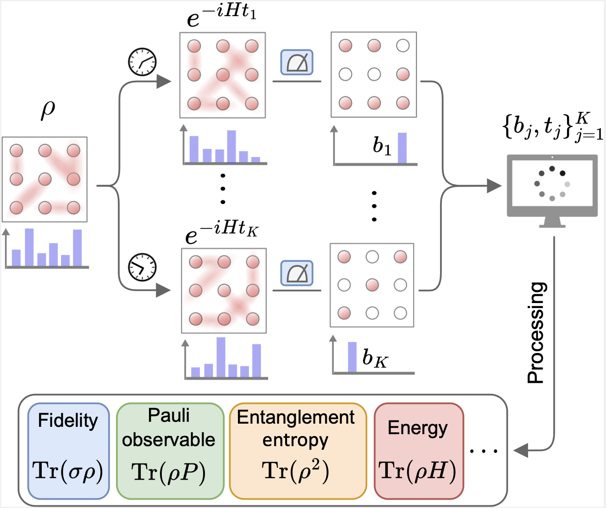

# Hamiltonian shadow numerical simulations

We present the source codes for all numerical simulations in our paper ["Predicting Arbitrary State Properties from Single Hamiltonian Quench Dynamics"](https://arxiv.org/pdf/2311.00695.pdf). 

<p align="center">
  
</p>

In this work, we propose the ***Hamiltonian shadow*** protocol, which solely depends on quench dynamics with a single Hamiltonian without any ancillary systems. The Hamiltonian shadow protocol does not require sophisticated control and is universally applicable to various analog quantum systems. The new protocol creates many opportunities for applying randomized measurements for analog quantum simulators without precise control and ancillary systems.

## 1. Unbiasedness of Hamiltonian shadow

This experiment corresponds to `FIG.2` in our paper. To obtain the data, come to the directory and run the program:

``` bash
cd ./src/bias && python bias.py
```

The data will be stored in `"./src/bias/store/"`.

## 2. Variance analysis

### 2.1 Influence of hamiltonian on variance with linear observable

This experiment corresponds to `FIG.3(a)` and `FIG.16` in our paper. To obtain the data, firstly come to the directory:

``` bash
cd ./src/variance_theta
```
Then run `theta_frame.ipynb` in jupyter notebook, the data will be stored in `"./src/variance_theta/store/"`.

### 2.2 Influence of hamiltonian on variance with non-linear observable

This experiment corresponds to `FIG.15` in our paper. To obtain the data, firstly come to the directory:

``` bash
cd ./src/variance_theta
```
Then run `theta_purity.ipynb` in jupyter notebook, the data will be stored in `"./src/variance_theta/store/"`.

### 2.3 Influence of qubit number on variance

This experiment corresponds to `FIG.3(b)` in our paper. To obtain the data, come to the directory and run the program:

``` bash
cd ./src/variance_qubitnum && python var_n.py
```

The data will be stored in `"./src/variance_qubitnum/store/"`.

## 3. Rydberg atom system performance with limited time window

### 3.1 Estimating fidelity

This experiment corresponds to `FIG.4(b)` in our paper. To obtain the data, come to the directory and run the program:

``` bash
cd ./src/rydberg && python rydberg_fidelity.py
```

The data will be stored in `"./src/rydberg/store/"`.

### 3.2 Estimating local observable

This experiment corresponds to `FIG.4(c)` in our paper. To obtain the data, come to the directory and run the program:

``` bash
cd ./src/rydberg && python rydberg_ZXZ.py
```

The data will be stored in `"./src/rydberg/store/"`.

### 3.3 Estimating subsystem purity

This experiment corresponds to `FIG.4(d)` in our paper. To obtain the data, come to the directory, firstly run the theoretical simulation of purity during the evolution:

``` bash
cd ./src/rydberg && python rydberg_purity_theory.py
```

Then run the simulation program of Hamiltonian shadow:

``` bash
python rydberg_purity.py
```

The data will be stored in `"./src/rydberg/store/"`.

## 4. Supplementary experiments

### 4.1 Frame potential analysis

This experiment corresponds to `FIG.11` in our paper. To obtain the data, come to the directory and run the program:

``` bash
cd ./src/appendix && python frame_potential.py
```

The data will be stored in `"./src/appendix/store/"`.

### 4.2 Single qubit analysis

This experiment corresponds to `FIG.12` in our paper. To obtain the data, firstly come to the directory:

``` bash
cd ./src/appendix
```
Then run `single_qubit.ipynb` in jupyter notebook, the data will be stored in `"./src/appendix/store/"`.

### 4.3 Hadamard version of Hamiltonian shadow

This experiment corresponds to `FIG.14` in our paper. To obtain the data, firstly come to the directory:

``` bash
cd ./src/appendix
```

Then run `hadamard_version.ipynb` in jupyter notebook, the data will be printed out.
